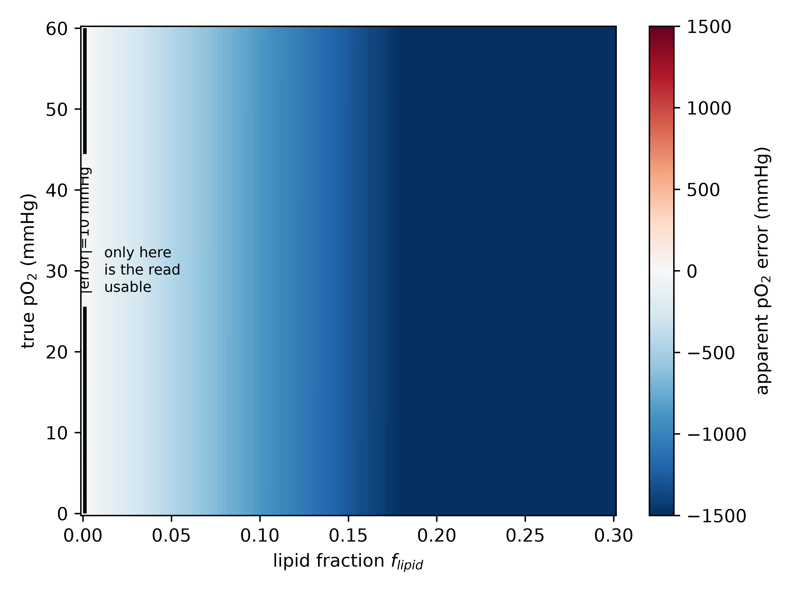
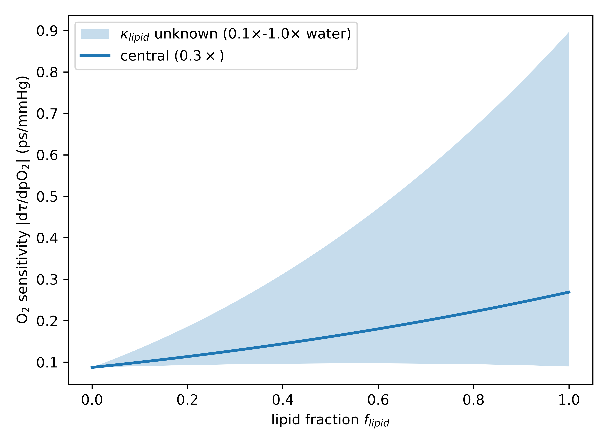
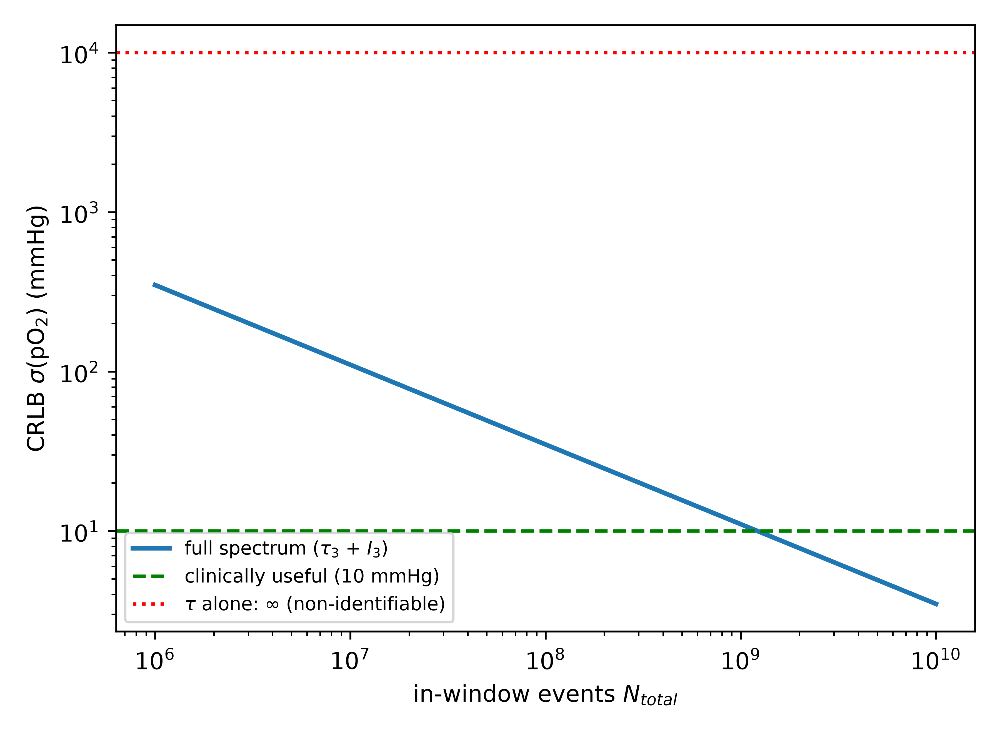
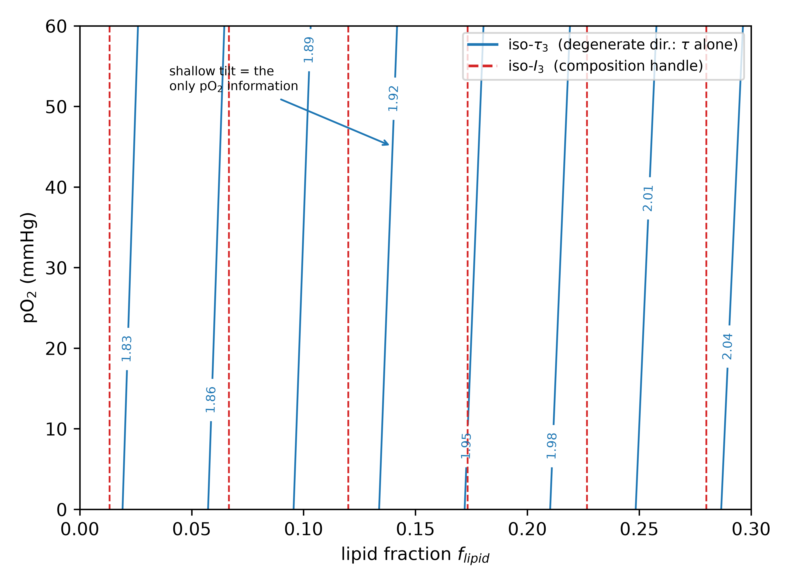
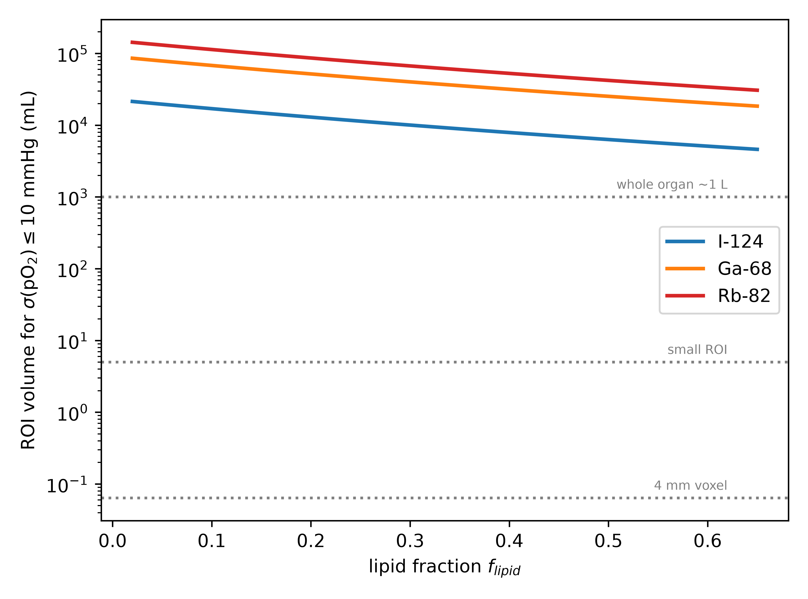
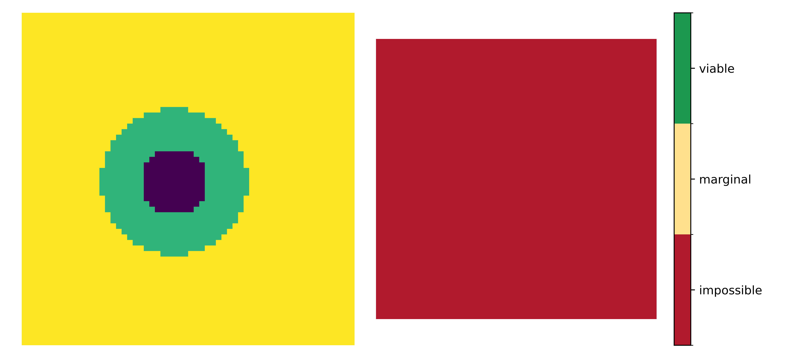
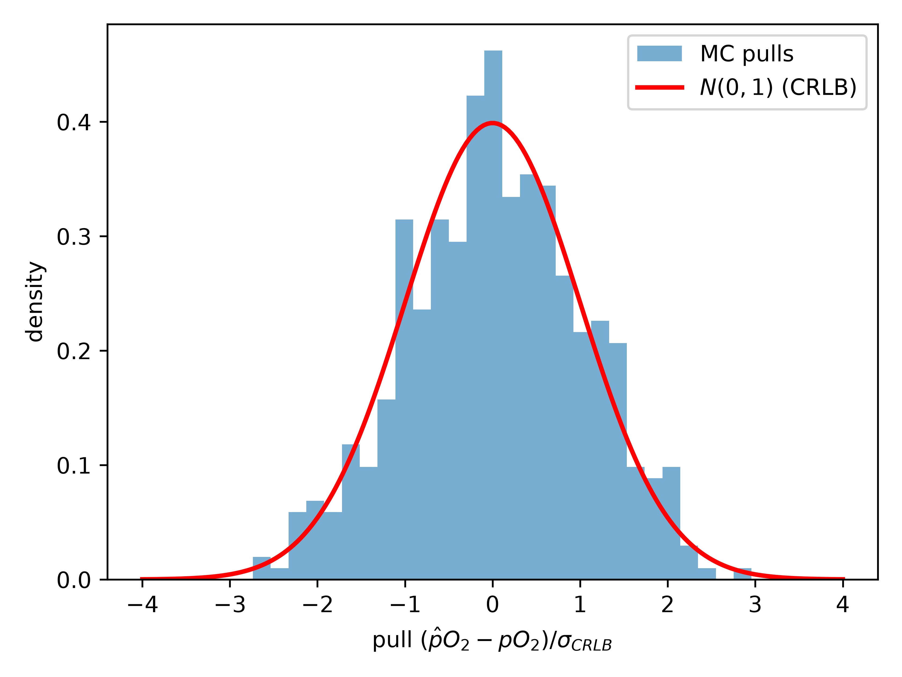

# Oxygenation versus composition in positronium-lifetime imaging: a quantified identifiability limit and a lipid-driven hypoxia bias

**Author:** Ernest Darell Zermeño¹,²

¹ Universidad Panamericana, Mexico.
² Universidad de Guadalajara, Guadalajara, Mexico.
Correspondence: 0244552@up.edu.mx.

*Preprint — modeling / methods. Version 1.*

---

## Abstract

**Background.** Ortho-positronium (o-Ps) lifetime, now measurable in vivo on long-axial-field-of-view (LAFOV) PET/CT, has been proposed as a biomarker of tissue oxygenation and hypoxia. The o-Ps lifetime, however, depends on **both** dissolved oxygen and tissue composition (free-volume/lipid content). That these are confounded is widely acknowledged qualitatively, but, to our knowledge, the confound has not been quantified as an oxygen-versus-composition identifiability/CRLB problem.

**Aim.** To quantify (i) whether pO$_2$ and composition are separable from o-Ps observables, (ii) the hypoxia-imaging bias that follows from ignoring composition, and (iii) the statistical conditions under which separation is — or is not — feasible.

**Methods.** We build a transparent rate-additivity forward model mapping (pO$_2$, lipid fraction $f$) to the o-Ps lifetime $\tau_3$ and intensity $I_3$, with constants sourced and the two load-bearing unknowns flagged. We derive the naive-reader bias, set up the Fisher-information / Cramér–Rao analysis for $\theta=(pO_2, f)$ from $\tau_3$ alone and from $(\tau_3, I_3)$, compute a rigorous Poisson-spectrum Fisher information (with spectral-nuisance profiling), validate fixed-nuisance CRLB attainability by parametric Monte Carlo, and translate the bound into clinically meaningful counts and ROI volumes for realistic isotopes.

**Results.** From the lifetime alone, pO$_2$ and composition are **structurally non-identifiable** (rank-1 Fisher). Even 2--5% lipid throws a naive hypoxia read by hundreds of mmHg, so an uncorrected lifetime map is composition-dominated. A second observable — the o-Ps intensity $I_3$ — restores identifiability **in principle**, but weakly: the Cramér–Rao bound on pO$_2$ is about 330--760 mmHg at $10^5$ o-Ps counts (a bracket spanning optimistic to nuisance-profiled noise models). A parametric Monte Carlo confirms that the fixed-nuisance Poisson bound is statistically attainable under the assumed spectrum model. Clinically useful separation ($\sigma_{pO_2}\leq 10$ mmHg) requires **litres** of pooled signal even with $^{124}$I, and is impossible at native voxel resolution. We also correct a planning-stage error the model itself exposed: the separability condition is a non-collinear Jacobian; in the pessimistic case where $I_3$ has no oxygen response, the composition handle is $\partial I_3/\partial(\text{composition})\neq 0$.

**Conclusion.** Positronium-lifetime hypoxia mapping is identifiability- and statistics-limited. We provide the bias formula, the count/volume/isotope requirements, the second-observable prescription, and the decisive bench experiment that would settle the two unmeasured constants.

**Keywords:** positronium lifetime imaging; ortho-positronium; tissue oxygenation; hypoxia biomarker; identifiability; Cramér–Rao bound; PET/CT.

---

## 1. Introduction

In a fraction of positron–electron annihilations the pair first forms positronium; its triplet form, ortho-positronium (o-Ps), is metastable and in matter localises in nanometre-scale free-volume voids, annihilating predominantly by pick-off. Its lifetime ($\approx$ 1.5–3 ns in soft tissue) therefore reports the size of those voids — i.e. tissue composition and microstructure. Paramagnetic molecular oxygen additionally shortens the o-Ps lifetime through spin (ortho$\to$para) conversion, with a rate linear in dissolved-O$_2$ concentration [1,2]. This oxygen sensitivity is the physical basis for proposing o-Ps lifetime as an in-vivo imaging biomarker of tissue oxygenation and hypoxia [1,3,4] — a clinically valuable target, since hypoxic tumour regions are radio- and chemo-resistant and current surrogates (e.g. $^{18}$F-FMISO PET) are limited.

Positronium lifetime imaging (PLI) has moved from the bench to the clinic: dedicated multi-photon systems and commercial LAFOV PET/CT scanners now produce in-vivo human positronium images and per-region lifetimes [5,6]. These are real achievements. They do not, by themselves, establish that an in-vivo lifetime *contrast* reflects oxygenation, because the lifetime is dominated by composition: between soft tissues the o-Ps lifetime varies by about 0.5 ns (adipose 2.54 ns vs muscle/hepatic about 2.0 ns [7]), whereas the oxygen-specific term implied by published quenching constants is on the order of a few picoseconds across physiological dissolved-oxygen differences [1]. The oxygen signal therefore sits inside a composition baseline two orders of magnitude larger, and — tellingly — published oxygen calibrations central to these claims have been performed in water or aqueous samples [1], where composition is fixed and the confound is invisible by design.

The field acknowledges this confound qualitatively: o-Ps lifetime is "the convolution of several phenomena, such as oxygen and free-radical concentration, in addition to the average void radius" [7], and reviews note that it is "presently not known how much o-Ps lifetime increases when pO$_2$ decreases by 50 mmHg" in living tissue. But no work has written down what that does to *identifiability* or to the resulting *imaging bias*. That is the gap this paper fills.

Recent work has proposed joint lifetime and $3\gamma/2\gamma$ readouts for pO$_2$ [12,13,16]. Here we make the composition problem quantitative. We (i) prove that pO$_2$ and composition are structurally non-identifiable from the lifetime alone; (ii) quantify the lipid-driven hypoxia bias in mmHg; (iii) determine when a second observable (the o-Ps intensity $I_3$, or the $3\gamma/2\gamma$ ratio) breaks the degeneracy, and at what statistical cost; (iv) translate the bound into count, ROI-volume and isotope requirements under explicit yield scenarios; and (v) specify the bench experiment that would measure the two load-bearing quantities. This is a *limits* paper, not a claim that o-Ps senses oxygen. It is the in-silico complement to a companion single-subject in-vivo demonstration of the same confound in human cardiac PLI [17].

## 2. Methods

### 2.1 Rate-additivity forward model
We model the o-Ps decay rate as a sum of independent channels,
$$ \lambda_3 = 1/\tau_3 = \lambda_{\mathrm{pickoff}}(f) + \kappa(f)\,\alpha(f)\,pO_2 , $$
where $f\in[0,1]$ is the lipid (free-volume-rich) fraction of a two-compartment tissue, $\lambda_{\mathrm{pickoff}}(f)$ is the composition-dependent baseline rate, $\kappa$ is the o-Ps O$_2$ quenching constant, and $\alpha$ the O$_2$ solubility (so that $[\mathrm{O_2}]=\alpha\,pO_2$). The baseline lifetime $\tau_0(f)$ interpolates between water and lipid endpoints; the O$_2$ sensitivity is $|d\tau_3/dpO_2| = \tau_0^2\,\kappa\alpha$. The lipid:water oxygen-solubility ratio was anchored to published oil/lipid measurements [9,10]. The o-Ps intensity is modelled as composition-dependent, $I_3 = I_3^{w} + (\partial I_3/\partial f)\,f + (\partial I_3/\partial pO_2)\,pO_2$. Constants and sources are in Table 1. Two quantities are unmeasured in the biological lipid/protein environments relevant here and are treated as unknowns: the quenching constant in lipid, $\kappa_{\mathrm{lipid}}$ (swept over $0.1$--$1.0\times$ the water value), and the composition slope $\partial I_3/\partial f$.

### 2.2 The naive-reader bias
A "naive reader" assumes pure-water calibration ($f=0$) and inverts an observed lifetime to a pO$_2$. The apparent-pO$_2$ error as a function of true (pO$_2$, $f$) is the lipid-O$_2$ bias; because the composition-induced baseline shift dwarfs the oxygen term, this is the dominant error in any uncorrected hypoxia read.

### 2.3 Identifiability: structural and practical
For $\theta=(pO_2,f)$ we compute the Fisher information matrix (FIM) and the Cramér–Rao bound $\mathrm{Cov}(\hat\theta)\succeq F^{-1}$. **Structural** non-identifiability is read from the rank of $F$ (a rank-deficient $F$ $\Rightarrow$ infinite CRLB on a parameter combination); **practical** identifiability from the CRLB magnitudes and the parameter correlation $\rho$. This multi-parameter framing follows the same logic used in established imaging identifiability problems, for example dynamic contrast-enhanced MRI [14]. We evaluate the FIM (a) from the lifetime alone and (b) from $(\tau_3, I_3)$. Because from $\tau_3$ alone both parameters enter through the single scalar $\lambda_3$, the two score vectors are collinear and $F$ is rank-1 — the exact, structural source of the degeneracy.

### 2.4 Rigorous Poisson-spectrum FIM
The idealized two-observable FIM treats $\tau_3$ and $I_3$ as clean measurements; the realistic case fits the whole o-Ps lifetime spectrum. We therefore build the spectral density $m(t\,|\,\theta)$ — a two-component exponentially-modified-Gaussian (a fast component plus the o-Ps component, whose slope is $\tau_3(\theta)$ and amplitude $I_3(\theta)$) on a large flat accidental background — and compute the per-bin Poisson FIM, $F_{ab}=\sum_k m_k^{-1}\,\partial_a m_k\,\partial_b m_k$. This includes automatically the $\tau_3$–$I_3$ estimation covariance and is complementary to moment-based lifetime estimators and photon-economy analyses for lifetime measurements [8,15]. We additionally **profile** the spectral nuisances (background level, fast-component lifetime, prompt offset, instrument resolution) by extending the FIM to those parameters and marginalizing; the instrument response ($\sigma_{\mathrm{IRF}}$, $t_0$) is normally calibrated from the prompt peak and is kept fixed in the realistic case. As an internal estimator check, we simulate Poisson spectra under the same forward model and fit $(pO_2,f)$ by maximum likelihood to verify that the fixed-nuisance CRLB is attainable when the model is correctly specified.

### 2.5 Counts model and the separability boundary
We anchor the o-Ps triple-coincidence yield to a public $^{44}$Sc PLI phantom preprint (about $3.6\times10^4$ o-Ps counts in a 5.57 mL ROI [11]) and scale counts with ROI volume and an effective isotope-yield factor (prompt branching and source-to-background; $^{124}$I best in the scenario model, high-positron-energy $^{82}$Rb worst). These isotope factors are scenario-level effective-yield scalings, not universal measured constants. For each tissue state we then compute the ROI volume required to reach a target $\sigma_{pO_2}$, and we classify a virtual tumour voxel-by-voxel as viable / marginal / impossible.

Software: Python 3.13, NumPy, SciPy, Matplotlib; all code, constants and figures are released (Code availability).

## 3. Results

### 3.1 The lifetime alone cannot separate oxygenation from composition
Because pO$_2$ and $f$ enter only through the single summed rate $\lambda_3$, the $2\times2$ Fisher information from $\tau_3$ alone is rank-1: its determinant is zero and the CRLB on either parameter individually is infinite (Figure 4). This is **structural** non-identifiability — not a statistical shortfall but an algebraic one. Only the linear combination $\lambda_3$ is constrained.

### 3.2 A lipid-driven hypoxia bias of hundreds of mmHg
The composition baseline shift dominates the tiny oxygen term, so a naive water-calibrated read is catastrophically biased (Figure 1). For a tissue truly at pO$_2$ = 20 mmHg, ignoring composition produces an apparent-pO$_2$ error of $-178$ mmHg at 2% lipid, $-439$ mmHg at 5%, and $-860$ mmHg at 10% — values that are not merely large but unphysical (negative), showing the read is composition-dominated rather than oxygen-driven. The O$_2$ sensitivity itself is composition-dependent and uncertain: about 0.09 ps/mmHg in water, rising to between 0.09 and 0.90 ps/mmHg in pure lipid depending on the unmeasured $\kappa_{\mathrm{lipid}}$ (Figure 2) — the approximately 1--10$\times$ net sensitivity spread is precisely that unknown.

### 3.3 The intensity $I_3$ restores identifiability — and a corrected linchpin
In the pessimistic baseline model, oxygen acts only on the rate $\lambda_3$ and leaves the o-Ps formation probability $I_3$ unchanged, whereas composition moves both $\tau_3$ and $I_3$. With the two-vector observable $(\tau_3, I_3)$ the score directions are no longer collinear and the FIM becomes full-rank: pO$_2$ and $f$ are identifiable in principle. The formal condition is that the Jacobian of $(\lambda_3,I_3)$ with respect to $(pO_2,f)$ be non-collinear. The analysis corrected a planning-stage assumption: in the pessimistic case $\partial I_3/\partial pO_2=0$, the necessary composition handle is $\partial I_3/\partial f \neq 0$; as this slope $\to 0$ the CRLB diverges and the system is degenerate again. A non-zero $\partial I_3/\partial pO_2$ can help if it supplies a non-collinear oxygen-sensitive direction; it is not itself required.

### 3.4 The rescue is real but weak: the CRLB bracket
Identifiability does not imply precision. At $10^5$ o-Ps counts the CRLB on pO$_2$ at a hypoxic fatty voxel (pO$_2$ = 20, $f$ = 0.10) is, across noise models (Table 2): 332 mmHg (Poisson, nuisances fixed; optimistic), 570 mmHg (idealized analytic with the field's empirical lifetime precision), 665 mmHg (Poisson with the per-spectrum nuisances profiled; realistic), and 758 mmHg (all nuisances profiled; pessimistic). The realistic figure is about $2\times$ the optimistic one — the price of fitting the background and fast component. The $\tau_3$–$I_3$ estimation covariance that this entails raises the parameter correlation from $\rho=0.05$ (idealized) to $\rho=0.70$ (spectrum). The conclusion is robust to the noise model: the bound is hundreds of mmHg at $10^5$ o-Ps counts, implying about $3$--$5\times10^8$ o-Ps events for a 10 mmHg target in the profiled models. The spectrum FIM itself is parameterized by total in-window events, with $N_3=I_3(1-\mathrm{background})N_{\mathrm{total}}$; at the representative state, $10^5$ o-Ps counts correspond to about $1.1\times10^6$ in-window events.

The fixed-nuisance Poisson CRLB is not only formal. In parametric Monte Carlo at pO$_2$ = 20 mmHg and $f$ = 0.10, the maximum-likelihood estimator recovered the truth with empirical standard deviations matching the CRLB at both tested count levels (empirical/CRLB = 1.00--1.01 for pO$_2$; 0.98--1.01 for $f$). The pO$_2$ pull distribution was close to $N(0,1)$ (mean $+0.05$, standard deviation $1.00$; Supplementary Figure S1). This validates estimator attainability under the assumed spectrum model; it does not validate the unmeasured biological constants.

### 3.5 Feasibility: litres of pooling, voxel-scale impossible
Translated to the effective-yield scenarios (Figure 5, Figure 6), separating pO$_2$ from composition to $\sigma(pO_2)\leq 10$ mmHg requires ROI volumes of **litres**. At pO$_2$ = 10 mmHg and 5% lipid, the required pooled volume is about 20 L for the best-yield scenario ($^{124}$I), about 78 L for $^{68}$Ga, and about 130 L for $^{82}$Rb. Even at 60% lipid, where the higher O$_2$ sensitivity helps, the requirement remains about 5 L for $^{124}$I. At a native 4 mm clinical voxel (0.064 mL), the separation is impossible in 100% of the virtual tumour (Figure 6). Paradoxically, fatty tissue is "easier" to separate (its O$_2$ sensitivity is higher) but is also the most biased — both consequences of the same lipid-O$_2$ coupling.

## 4. Discussion

The practical implication is methodological and stark: an o-Ps lifetime map is **not** a hypoxia map. Reading hypoxia from $\tau_3$ alone is structurally impossible; doing it from $(\tau_3, I_3)$ is statistically out of reach at native resolution and current yields by three to four orders of magnitude. This does not refute the physics — oxygen does shorten o-Ps lifetime — but it bounds what can be inferred and tells the field exactly how far feasibility lies and what would change it.

Two constructive prescriptions follow. **First**, oxygenation work must extract and report a second observable — the o-Ps **intensity** $I_3$ and/or the $3\gamma/2\gamma$ ratio — not the lifetime alone. This is consistent with recent proposals to combine lifetime and $3\gamma/2\gamma$ oxygen readouts [16], but here the requirement comes from the oxygen-versus-composition identifiability condition. It is the o-Ps analogue of adding a second echo to make a fat/water separation full-rank. **Second**, where a co-registered CT or MRI provides composition, the bias formula of §3.2 supplies a composition-aware correction to any future lifetime-based read. The boundary of §3.5 also gives the field an honest target for acquisition design (counts, ROI pooling, isotope) tuned to *separation* rather than to resolving a single lifetime.

The same degeneracy was observed in vivo in a companion single-subject human cardiac PLI re-analysis, where a reproducible right>left ventricular lifetime contrast did not survive a structure-matched control and was traced to composition and instrument behaviour rather than oxygenation [17]. The present model explains *why* such contrasts are composition-dominated and quantifies the limit.

The honest ceiling: this is a model-based analysis. Its force is conditional on the rate-additivity forward model and on two constants not yet measured in the biological lipid/protein environments of interest — $\kappa_{\mathrm{lipid}}$ and $\partial I_3/\partial f$. We have made both explicit and swept the first; the second is the separability handle in the pessimistic case where oxygen does not move $I_3$. The analysis therefore does not "solve" hypoxia imaging — it organizes the problem, bounds it under stated assumptions, and points to the decisive measurement.

## 5. The decisive experiment

The two load-bearing unknowns are settled by a single bench measurement: a positron-annihilation-lifetime (PALS) matrix over O$_2$ $\times$ {water, lipid emulsion, protein/serum}, at controlled dissolved-oxygen with an independent pO$_2$ ground truth, recording both $\tau_3$ and $I_3$. This yields (i) $\kappa$ in lipid and protein (fixing the bias magnitude and the sensitivity), and (ii) $\partial I_3/\partial(\text{composition})$ and $\partial I_3/\partial pO_2$ (fixing whether, and how strongly, the degeneracy can be broken). It is self-contained, requires no scanner, and would convert this limits analysis into a measured one.

## 6. Limitations

The forward model is a transparent two-compartment rate-additivity form; richer free-volume models (Tao–Eldrup) and intensity chemistry (inhibition, scavenging) are not included. The o-Ps intensity values are illustrative placeholders; the composition slope $\partial I_3/\partial f$ is assumed non-zero in the baseline scenario (its measurement is the experiment of §5). $\kappa_{\mathrm{lipid}}$ is unmeasured in the relevant biological lipid/protein environments and swept. The counts model is anchored to one public preprint yield and uses scenario-level isotope factors rather than universal measured constants. Nuisance profiling bounds the realistic CRLB but the spectrum model is itself idealized. The Monte Carlo validates statistical attainability of the fixed-nuisance CRLB under the assumed forward spectrum; it is not a physical validation of $\kappa_{\mathrm{lipid}}$, $\partial I_3/\partial f$, or $\partial I_3/\partial pO_2$. A minimal PALS measurement or a real-data $I_3$ re-analysis remains the natural empirical anchor.

## 7. Conclusion

From the positronium lifetime alone, tissue oxygenation and composition are structurally non-identifiable; ignoring composition biases a hypoxia read by hundreds of mmHg; the o-Ps intensity can break the degeneracy in principle but only with litres of pooled signal under current yield scenarios, making voxel-scale clinical pO$_2$ mapping infeasible without a $10^3$--$10^4\times$ yield gain. We provide the bias formula, the identifiability and count/volume/isotope requirements, the corrected separability condition (a non-collinear second-observable Jacobian), and the decisive experiment. Positronium-lifetime contrasts should not be interpreted as oxygenation maps until composition is controlled and a second observable is measured.

---

## Declarations

**Ethics.** This work is a modeling/methods study using no human or animal data.

**Data & code availability.** All analysis code, constants, intermediate results and figures are released at https://github.com/Jefemaestro33/oxygenation-versus-tissue-composition-in-positronium-lifetime-pet-identifiability-limit (MIT for code; CC-BY-4.0 for text and figures, as specified in the repository license files).

**Competing interests.** The author declares no competing interests.

**Funding.** No specific funding was received.

**Author contributions.** E.D.P.Z. conceived the study, performed the analysis and wrote the manuscript. The analysis was implemented and cross-checked with AI-assisted pipelines under the author's direction; the AI systems are tools and are not authors.

---

\clearpage

## Figure legends

**Figure 1.** Naive-reader apparent-pO$_2$ error (mmHg) when composition is ignored, over true pO$_2$ and lipid fraction. The read is usable only in a thin sliver at $f\approx0$; a few percent lipid drives the apparent pO$_2$ hundreds of mmHg off.

{width=78%}

**Figure 2.** O$_2$ sensitivity $|d\tau_3/dpO_2|$ versus lipid fraction. The shaded band is the unmeasured lipid quenching constant ($\kappa_{\mathrm{lipid}}=0.1$--$1.0\times$ water); the approximately 1--10$\times$ net sensitivity spread is that unknown.

{width=70%}

\pagebreak

**Figure 3.** Cramér–Rao bound $\sigma(pO_2)$ versus total in-window counts for the full-spectrum $(\tau_3,I_3)$ fit; the lifetime-alone case is non-identifiable ($\infty$). A 10 mmHg target needs order-$10^9$ in-window events, corresponding to order-$10^8$ o-Ps counts after the $N_3=I_3(1-\mathrm{background})N_{\mathrm{total}}$ conversion.

{width=70%}

**Figure 4.** Why $(\tau_3,I_3)$ breaks the degeneracy. Iso-$\tau_3$ contours run nearly along the (pO$_2$,$f$) degeneracy direction (oxygen only slightly tilts $\tau_3$); iso-$I_3$ contours pin composition. The crossing is shallow $\Rightarrow$ identifiable but statistics-limited.

{width=78%}

\pagebreak

**Figure 5.** ROI volume required for $\sigma(pO_2)\leq 10$ mmHg versus lipid fraction, for three effective-yield isotope scenarios. Clinical separation needs litres of pooled signal; voxel-scale (about 0.06 mL) is far off-scale.

{width=72%}

**Figure 6.** Virtual tumour (hypoxic core, normoxic rim, normal tissue): true pO$_2$ (left) and separability at a native 4 mm voxel (right) — impossible everywhere.

{width=95%}

---

\clearpage

## Supplementary figure

**Figure S1.** Parametric Monte-Carlo validation of the fixed-nuisance Poisson CRLB under the assumed spectrum model. Pulls of $\hat{p}O_2$ are close to $N(0,1)$, showing that the maximum-likelihood estimator reaches the fixed-nuisance CRLB when the forward model is correctly specified.

{width=72%}

---

\clearpage

## Tables

**Table 1.** Forward-model constants (measured) and the two unmeasured unknowns.

| Quantity | Value | Status | Source |
|---|---|---|---|
| $\tau_0$ water | 1.815 ns | measured | EJNMMI Phys 2024 |
| $\tau_0$ adipose | 2.5–2.7 ns | measured | [7] |
| $\kappa$(O$_2$) water | 0.0204 µmol$^{-1}$µs$^{-1}$L | measured | [1,2] |
| O$_2$ solubility lipid:water | about $5\times$ | measured | [9,10] |
| mechanism | spin (ortho$\to$para) conversion | confirmed | [2] |
| **$\kappa_{\mathrm{lipid}}$** | **unmeasured (swept 0.1–1.0$\times$)** | **unknown** | §5 |
| **$\partial I_3/\partial$ composition** | **unmeasured (assumed $\neq 0$)** | **unknown** | §5 |

**Table 2.** Cramér–Rao bound on pO$_2$ at pO$_2$ = 20 mmHg, $f$ = 0.10, $10^5$ o-Ps counts — robust to the noise model.

| Noise model | $\sigma(pO_2)$ (mmHg) | $\rho$ |
|---|---|---|
| Poisson, nuisances fixed (optimistic) | 332 | +0.70 |
| Idealized analytic (field $\sigma_\tau$) | 570 | +0.05 |
| Poisson, per-spectrum nuisances profiled (realistic) | 665 | — |
| Poisson, all nuisances profiled (pessimistic) | 758 | — |

---

\clearpage

## References

1. Shibuya K, Saito H, Nishikido F, Takahashi M, Yamaya T. Oxygen sensing ability of positronium atom for tumor hypoxia imaging. *Commun Phys* 3, 173 (2020). doi:10.1038/s42005-020-00440-z
2. Stepanov PS, Selim FA, Stepanov SV, et al. Interaction of positronium with dissolved oxygen in liquids. *Phys Chem Chem Phys* 22, 5123 (2020). doi:10.1039/c9cp06105c
3. Moskal P, Kisielewska D, Curceanu C, et al. Feasibility study of the positronium imaging with the J-PET tomograph. *Phys Med Biol* 64, 055017 (2019). doi:10.1088/1361-6560/aafe20
4. Moskal P, Stępień EŁ. Positronium as a biomarker of hypoxia. *Bio-Algorithms Med-Syst* (2021). doi:10.1515/bams-2021-0189
5. Moskal P, Baran J, Bass S, et al. Positronium image of the human brain in vivo. *Sci Adv* 10, eadp2840 (2024). doi:10.1126/sciadv.adp2840
6. Mercolli L, Steinberger WM, Sari H, et al. In vivo positronium lifetime measurements with intravenous tracer administration and a long axial field-of-view PET/CT. *IEEE Trans Radiat Plasma Med Sci* (2026). doi:10.1109/TRPMS.2026.3687923
7. Avachat AV, et al. Ortho-positronium lifetime for soft-tissue classification. *Sci Rep* 14, 21155 (2024). doi:10.1038/s41598-024-71695-7 (arXiv:2409.13102)
8. Berens L, Hsu I, Chen CT, Halpern H, Kao CM. An analytic, moment-based method to estimate orthopositronium lifetimes in positron annihilation lifetime spectroscopy measurements. *Bio-Algorithms Med-Syst* 20(Spec. Issue), 40--48 (2024). doi:10.5604/01.3001.0054.9141
9. Battino R, Evans FD, Danforth WF. The solubilities of seven gases in olive oil. *J Am Oil Chem Soc* 45, 830 (1968). doi:10.1007/BF02540163
10. Roppongi T, Mizuno N, Miyagawa Y, Kobayashi T, Nakagawa K, Adachi S. Solubility and mass transfer coefficient of oxygen through gas- and water-lipid interfaces. *J Food Sci* 86, 867--873 (2021). doi:10.1111/1750-3841.15641
11. Mercolli L, Steinberger WM, Grundler PV, et al. First positronium lifetime imaging with scandium-44 on a long axial field-of-view PET/CT. arXiv:2506.13460 (2025).
12. Alkhorayef MA, Abuelhia EI, Chin MPW, Spyrou NM. Determination of the relative oxygenation of samples by ortho-positronium 3-gamma decay for future application in oncology. *J Radioanal Nucl Chem* 281, 171--174 (2009). doi:10.1007/s10967-009-0123-6
13. Alkhorayef M, Sulieman A, Alsager OA, Alrumayan F, Alkhomashi N. Investigation of using positronium and its annihilation for hypoxia PET imaging. *Radiat Phys Chem* 188, 109690 (2021). doi:10.1016/j.radphyschem.2021.109690
14. Sourbron SP, Buckley DL. Classic models for dynamic contrast-enhanced MRI. *NMR Biomed* 26, 1004--1027 (2013). doi:10.1002/nbm.2940
15. Köllner M, Wolfrum J. How many photons are necessary for fluorescence-lifetime measurements? *Chem Phys Lett* 200, 199--204 (1992). doi:10.1016/0009-2614(92)87068-Z
16. Moskal P. Quantum entanglement degree, mean positronium lifetime, and the $3\gamma$/$2\gamma$ annihilation-rate ratio as novel PET biomarkers for hypoxia -- concept, challenges, and predictions. *Bio-Algorithms Med-Syst* 22, 56 (2026). doi:10.5604/01.3001.0055.7461
17. Zermeño ED. Cardiac positronium lifetime in human PET: a reproducible right–left ventricular contrast that is not explained by blood oxygenation. *medRxiv* (2026). doi:10.64898/2026.06.14.26355630
